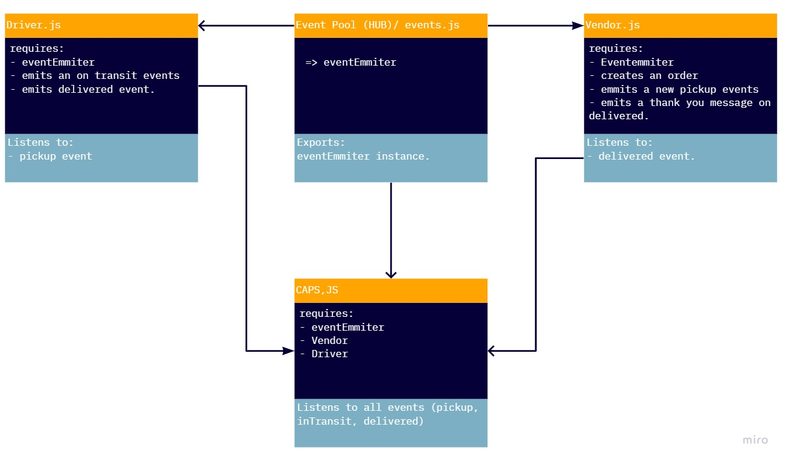

# caps

[pull request](https://github.com/JalalHasan-22/caps/pull/3)

The Code Academy Parcel Service

In this lab, we are starting to build an event driven application, this application will be for:

1. the vendors to update the system that there is a parcel to be picked up.
2. notify the driver to go pickup a parcel from the vendor.
3. the driver notifying the system that the parcel is in transit.
4. the driver notifyin the system that the parcel has been delivered.

I have seperated the events handlers between the driver events and the vendor events all making use of the same event hub created in the lib folder.
the caps.js file is the starting point for this project, where all the events will be emmitted.

below you can find the UML diagrame for this lab, based on the user stories and this UML will be updated according to each lab assignment.

